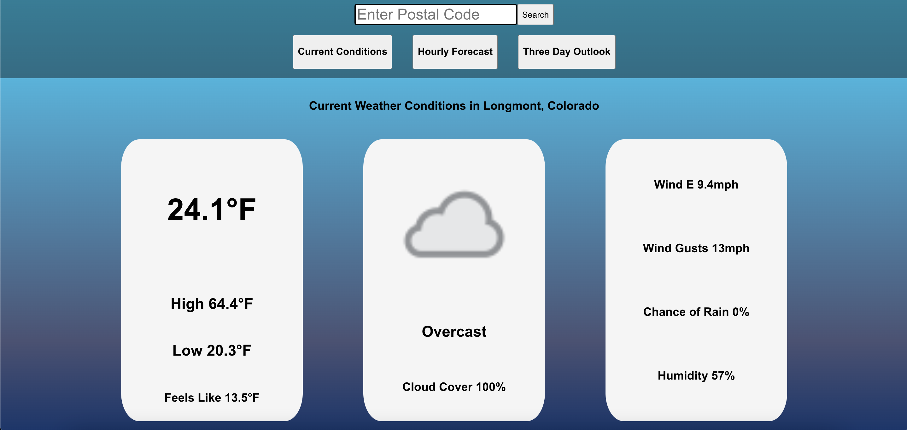
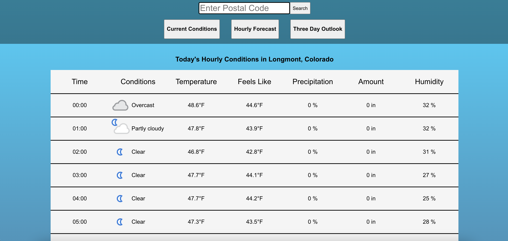

# Weather or Not Weather App

[Deployed App](https://musherweatherornot.herokuapp.com/)

## Description
Weather or Not utilizes an API providing realtime weather data to form a simple weather app. The app allows users to input a postal code location and recieve relevant weather information for that area. Weather or Not allows users to select between current conditions, three day weather outlook, and an hourly breakdown of the current day's weather. Additionally the app is able to remember the most recently searched location, so that the relevant weather data for that location is immediatly returned upon the user's return to the site.

## Technologies Used
- HTML
- CSS
- React JS
- [Weather API](https://www.weatherapi.com/)
- Git
- Heroku (for deployment)

## Getting Started
To use the app simply open throught the deployed link above and input a postal code in the search bar. Upon pressing search or your enter/return key, the site will display the relevant weather information for th location you chose.

## Contribution Guidelines
Best improvements could be made by creating new componenets or elements to display additonal relevant information, such as AQI, Weather Alerts, and Astronomical data. Additonally, css and general formatting could be improved to give the site a more approachable look. Previous user searches added to a drop down list or a linked list beneath the search bar could be a significant improvement as well.
